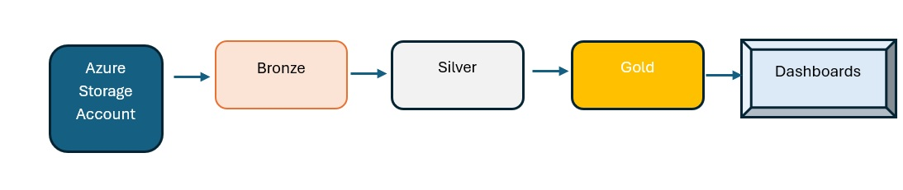
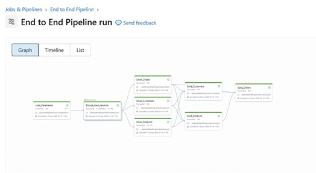

# Design Document: Retail Data Pipeline (Medallion Architecture)
## 1. Problem Statement
The goal of this project is to load and process retail information and generate dashboard which can help the business derive information.

## 2. Architecture Overview
Design 
Load Orders, customers, Products information from Azure Storage account. 

Ingestion: Autoloader (Stream ingestion) is used ingestion into bronze layer. 

## Bronze to Silver layer:
•	Data clean up
•	Data transformation (concatenate first name and last name, Date format change)

•	Derive additional fields which can be used later for reporting (Domain, year)

•	Used functions to derive additional fields (discounted price)

•	Implemented SCD Type 1 for Customers (data is updated and no history is maintained. create_date for updated records remain the earlier value, update_date is current timestamp).

•	Implemented SCD type 2 for Products using DLT decorators. Set expectations to implement data quality checks.

## Silver to Gold :
•	Fact and dimension tables were loaded ( Fact_Orders, dim_products, dim_customers)

•	Views built using Rank and aggregations to be used by dashboards.

## Dashboard :
•	Total revenue

•	Total orders placed

•	Top 5 selling products

•	Top 5 customers based on expenditure

•	Customer share as per Domain.

•	Total Orders per state

## End to End pipeline build

